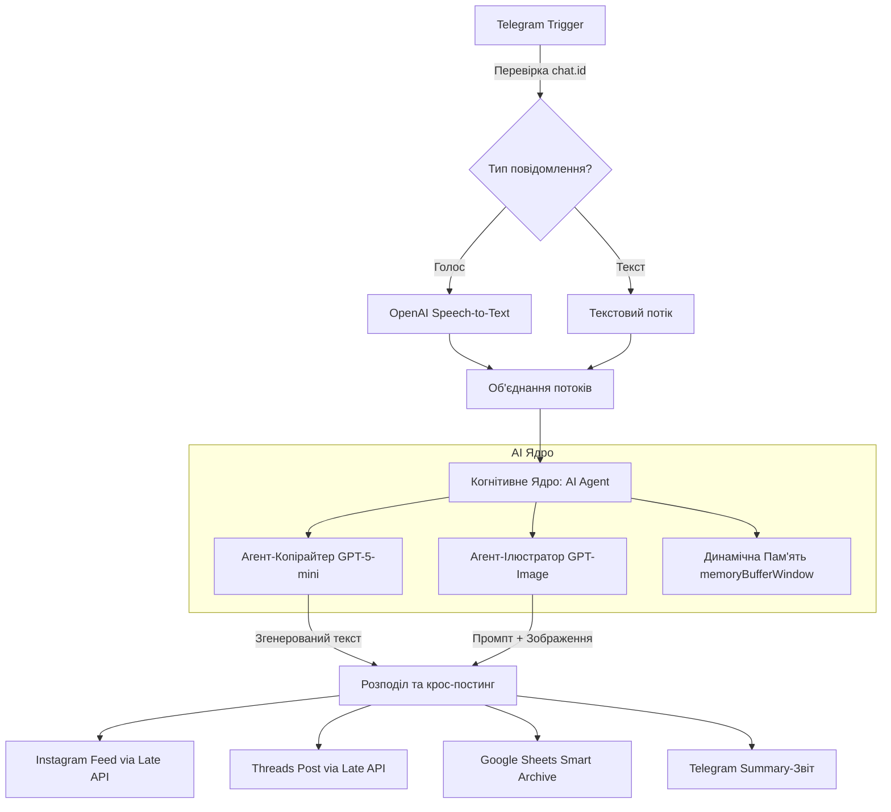

# AI Social Media Assistant v1.01 (N8N Assistant)

> **Автономна контент-фабрика у вашому кишені.** Повністю автоматизований робочий процес для n8n, який перетворює голосові або текстові ідеї в професійні ілюстровані публікації та публікує їх в Instagram та Threads із веденням архіву в Google Sheets.

---

## 📂 Склад репозиторію
* `workflow.json` — готовий сценарій для імпорту в n8n.
* `README.md` — інструкція з налаштування та запуску.

---

## 🛠️ Технологічний стек
* **Платформа автоматизації:** n8n (Advanced Workflow, Switch, Code Nodes).
* **AI-Ядро:** OpenAI API (GPT-5-mini для генерації текстів, GPT-Image / DALL-E для генерації графіки).
* **Керування пам'яттю:** LangChain архітектура (модуль `memoryBufferWindow`).
* **Дистрибуція:** Telegram Bot API (вхід/управління), Zernio/Late API (публікація в Instagram & Threads), Google Sheets API (база даних / архів).

---

## 📐 Архітектура системи (Workflow)



---

## ⚡ Опис когнітивного ядра

### 1. Агент-Копірайтер (GPT-5-mini)
Налаштований за допомогою розширеного промпт-інжинірингу як копірайтер світового рівня.
* **Формат:** Створює живі тексти короткими абзацами (1–3 речення, до 490 символів).
* **Ефект присутності:** Штучно інтегрує легкі людські недосконалості (паузи, вставні слова «слухай», «вибач»), щоб текст не виглядав як суха генерація машини.

### 2. Агент-Ілюстратор (Image Agent + GPT-Image)
* Автоматично аналізує контекст згенерованого поста.
* Формує лаконічний промпт англійською мовою.
* Генерує цифрову ілюстрацію у стилі *flat style*, оптимізовану за розміром ($<500$ КБ) та пропорціями ($4:5$) під Instagram Feed.

### 3. Динамічна пам'ять (`memoryBufferWindow`)
Утримує контекст останніх **11 повідомлень**, що дозволяє вести живий діалог з ботом у режимі реального часу (наприклад, написати йому: *«Зроби текст коротшим»* або *«Додай більше емодзі»*).

---

## 🔧 Встановлення та налаштування

### 1. Передумови
* Встановлений локальний або хмарний **n8n** (версії 1.0 або новішої).
* Акаунт **OpenAI** з балансом для API-запитів.
* Створений **Telegram-бот** через `@BotFather` (токен доступу).
* Акаунт у сервісі **Zernio** або **Late API** для публікацій в Instagram та Threads.
* Доступ до **Google Таблиць** для логування.

### 2. Імпорт воркфлоу
1. Створіть новий порожній Workflow в n8n.
2. Скопіюйте вміст файлу `workflow.json` (або імпортуйте через меню *Import from File*).
3. Натисніть **Ctrl + V** на робочій області n8n.

### 3. Налаштування облікових записів (Credentials)
Вам необхідно налаштувати та підключити облікові дані у відповідних нодах:
* **Telegram Trigger / Telegram Send:** Підключіть токен вашого Telegram-бота.
* **OpenAI Chat Model / Speech-to-Text:** Підключіть ваш OpenAI API Key.
* **Google Sheets Node:** Авторизуйте доступ до вашого Google Диска за допомогою OAuth2 або Service Account.
* **HTTP Request Nodes (Late API / Zernio):** Вкажіть токени авторизації для публікації у соцмережах.

### 4. Налаштування безпеки
У першій ноді обробки (Code Node після тригера) обов'язково вкажіть ваш `chat.id` у списку дозволених адміністраторів, щоб ботом не могли скористатися сторонні особи:
```javascript
const allowedChatIds = ['ВАШ_TELEGRAM_CHAT_ID'];
```

---

## 📈 Бізнес-цінність (ROI)
* **Автономність 100%:** Процес від виникнення ідеї (навіть під час руху за кермом через голосове повідомлення) до готової публікації займає всього **15 секунд**.
* **Економія:** Повністю замінює ручну роботу копірайтера, дизайнера та SMM-менеджера для типових публікацій.
* **Масштабованість:** Можливість легкого підключення інших каналів дистрибуції (Facebook, LinkedIn, Telegram-канали).
