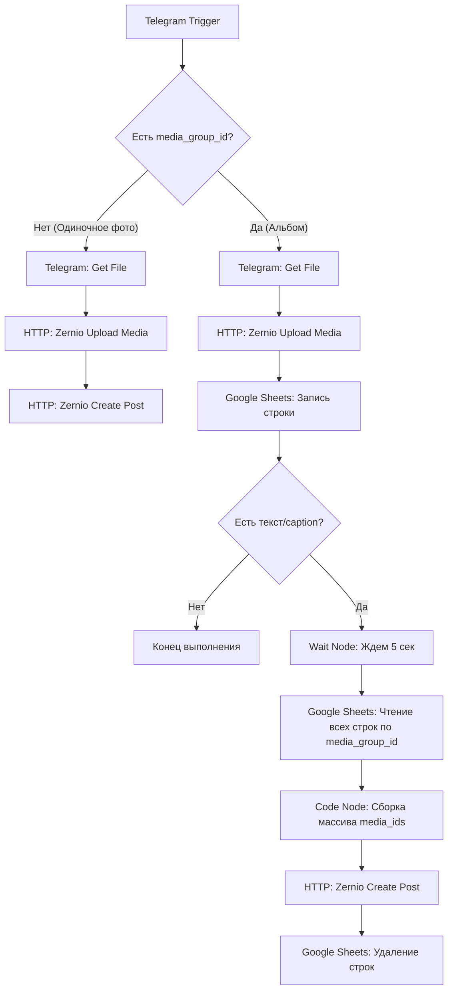

# 🤖 Автоматизация n8n: Публикация каруселей в Instagram через Zernio API из Telegram

Этот документ описывает готовую архитектуру сценария для **n8n**, который автоматически ловит публикации (включая альбомы/карусели из нескольких фото с текстом) из твоего Telegram-канала, группирует их, загружает медиафайлы в Zernio API и публикует карусель в Instagram.

---

## 📐 Архитектура воркфлоу (Схема)

Когда ты отправляешь альбом (Media Group) в Telegram, Telegram Bot API присылает каждую фотографию как отдельный запрос (webhook) с одинаковым `media_group_id`. Текст описания (caption) прикрепляется только к **одной** из фотографий. 

Ниже представлена логика разделения и сборки:



---

## 📋 Подготовка: Таблица Google Sheets

Для временного хранения ID загруженных файлов создай простую Google Таблицу (например, с именем `Instagram_Queue`) и листом `Temp_Carousel`. В ней должно быть 4 колонки:
1. `media_group_id` (текст)
2. `media_id` (текст)
3. `caption` (текст)
4. `timestamp` (дата/время)

---

## 🛠️ Пошаговое описание узлов в n8n

### 1. Telegram Trigger
* **Trigger on:** `Message`
* **Фильтр (по желанию):** Твой канал или чат.

### 2. Set Node (Извлечение параметров)
* Извлекаем `media_group_id` (выражение: `{{ $json.media_group_id || "" }}`).
* Извлекаем `caption` (выражение: `{{ $json.caption || "" }}`).
* Извлекаем `file_id` самой качественной фотографии:
  Выражение: `{{ $json.photo[ $json.photo.length - 1 ].file_id }}`

### 3. Telegram Node (Get File)
* **Resource:** `File`
* **Operation:** `Get`
* **File ID:** `{{ $json.file_id }}`
* *Этот узел скачивает бинарный файл фото из Telegram в память n8n.*

### 4. HTTP Request: Zernio Upload Media
* **Method:** `POST`
* **URL:** `https://zernio.com/api/v1/media`
* **Authentication:** `Header Auth` (Имя: `Authorization`, Значение: `Bearer YOUR_ZERNIO_API_KEY`)
* **Send Binary Data:** `true` (ставим галочку)
* **Body Content Type:** `Form-Data`
* **Parameters (Form-Data):**
  * Name: `file`
  * Parameter Type: `Form-Data (Binary)`
  * Input Data Field Name: `data` *(или имя бинарного поля из предыдущего узла)*
* *Выход узла вернет JSON:* `{"media_id": "zernio-media-id-123", "status": "success"}`

### 5. Switch Node (Разделение логики)
* **Value to test:** `{{ $json.media_group_id }}`
* **Routing:**
  * Если **пусто (empty)** $\rightarrow$ Идем на публикацию одиночного поста.
  * Если **не пусто (not empty)** $\rightarrow$ Идем на ветку карусели.

---

### 🟢 Ветка А: Одиночный пост (Путь без media_group_id)
#### HTTP Request: Zernio Create Post
* **Method:** `POST`
* **URL:** `https://zernio.com/api/v1/posts`
* **Headers:** `Authorization: Bearer YOUR_ZERNIO_API_KEY`, `Content-Type: application/json`
* **JSON Body:**
```json
{
  "content": "=== Вставь Caption ===",
  "platforms": [
    {
      "platform": "instagram",
      "accountId": "YOUR_INSTAGRAM_ACCOUNT_ID"
    }
  ],
  "media_ids": ["{{ $json.media_id }}"],
  "publishNow": true
}
```

---

### 🔵 Ветка Б: Группировка Карусели (Путь с media_group_id)

#### 1. Google Sheets: Append Row
* Добавляем строку в созданную таблицу:
  * `media_group_id`: `{{ $json.media_group_id }}`
  * `media_id`: `{{ $json.media_id }}`
  * `caption`: `{{ $json.caption }}`
  * `timestamp`: `{{ new Date().toISOString() }}`

#### 2. If Node (Фильтр по тексту)
* **Condition:** `caption` $\rightarrow$ `Is Not Empty`.
* **Логика:**
  * **False (нет описания):** Завершаем выполнение. (Картинка записалась в таблицу, больше эта ветка ничего не делает. Это предотвращает отправку 5 дублирующих постов).
  * **True (есть описание):** Продолжаем выполнение.

#### 3. Wait Node
* **Amount:** `5`
* **Unit:** `Seconds`
* *Даем 5 секунд, чтобы все остальные фотографии альбома успели загрузиться в Zernio и записаться в Google Sheets.*

#### 4. Google Sheets: Get Rows
* **Operation:** `Get Many`
* **Filter:** Найти строки, где `media_group_id` равен `{{ $json.media_group_id }}`.

#### 5. Code Node (Сборка карусели)
* Вставляем простой JavaScript код для объединения всех `media_id` из таблицы в один массив:
```javascript
const items = $input.all();
const mediaIds = items.map(item => item.json.media_id);
const firstItem = items.find(item => item.json.caption && item.json.caption.length > 0) || items[0];

return [{
  json: {
    media_group_id: firstItem.json.media_group_id,
    caption: firstItem.json.caption,
    media_ids: mediaIds
  }
}];
```

#### 6. HTTP Request: Zernio Create Post Carousel
* **Method:** `POST`
* **URL:** `https://zernio.com/api/v1/posts`
* **JSON Body:**
```json
{
  "content": "{{ $json.caption }}",
  "platforms": [
    {
      "platform": "instagram",
      "accountId": "YOUR_INSTAGRAM_ACCOUNT_ID"
    }
  ],
  "media_ids": {{ JSON.stringify($json.media_ids) }},
  "publishNow": true
}
```

#### 7. Google Sheets: Delete Rows
* **Operation:** `Delete`
* **Filter:** Удалить строки, где `media_group_id` равен `{{ $json.media_group_id }}` (очистка временной базы).

---

## 📥 Готовый JSON-код для импорта в n8n

Выдели и скопируй этот JSON-код. Затем открой свой n8n, создай новый чистый воркфлоу и нажми `Ctrl + V` (Вставить). Воркфлоу импортируется автоматически:

```json
{
  "name": "Telegram to Instagram Carousel (Zernio)",
  "nodes": [
    {
      "parameters": {
        "updates": [
          "message"
        ],
        "additionalFields": {}
      },
      "id": "telegram-trigger",
      "name": "Telegram Trigger",
      "type": "n8n-nodes-base.telegramTrigger",
      "typeVersion": 1,
      "position": [100, 300]
    },
    {
      "parameters": {
        "fields": {
          "values": [
            {
              "name": "media_group_id",
              "value": "={{ $json.message.media_group_id || \"\" }}"
            },
            {
              "name": "caption",
              "value": "={{ $json.message.caption || \"\" }}"
            },
            {
              "name": "file_id",
              "value": "={{ $json.message.photo ? $json.message.photo[$json.message.photo.length - 1].file_id : \"\" }}"
            }
          ]
        },
        "options": {}
      },
      "id": "set-fields",
      "name": "Set Fields",
      "type": "n8n-nodes-base.set",
      "typeVersion": 1,
      "position": [300, 300]
    },
    {
      "parameters": {
        "operation": "get",
        "fileId": "={{ $json.file_id }}"
      },
      "id": "telegram-get-file",
      "name": "Telegram: Get File",
      "type": "n8n-nodes-base.telegram",
      "typeVersion": 1.1,
      "position": [500, 300]
    },
    {
      "parameters": {
        "method": "POST",
        "url": "https://zernio.com/api/v1/media",
        "sendBinaryData": true,
        "binaryDataKey": "data",
        "headersUi": {
          "parameter": [
            {
              "name": "Authorization",
              "value": "Bearer YOUR_ZERNIO_API_KEY"
            }
          ]
        }
      },
      "id": "zernio-upload-media",
      "name": "Zernio: Upload Media",
      "type": "n8n-nodes-base.httpRequest",
      "typeVersion": 4.1,
      "position": [700, 300]
    },
    {
      "parameters": {
        "rules": {
          "values": [
            {
              "conditions": {
                "options": {
                  "caseSensitive": true,
                  "leftValue": "",
                  "type": "string"
                },
                "conditions": [
                  {
                    "leftValue": "={{ $json.media_group_id }}",
                    "rightValue": "",
                    "operator": "isEmpty"
                  }
                ],
                "combinator": "and"
              },
              "renameKeys": true,
              "outputIndex": 0
            },
            {
              "conditions": {
                "options": {
                  "caseSensitive": true,
                  "leftValue": "",
                  "type": "string"
                },
                "conditions": [
                  {
                    "leftValue": "={{ $json.media_group_id }}",
                    "rightValue": "",
                    "operator": "isNotEmpty"
                  }
                ],
                "combinator": "and"
              },
              "outputIndex": 1
            }
          ]
        }
      },
      "id": "switch-logic",
      "name": "Is Album?",
      "type": "n8n-nodes-base.switch",
      "typeVersion": 1,
      "position": [920, 300]
    }
  ],
  "connections": {
    "Telegram Trigger": {
      "main": [
        [
          {
            "node": "Set Fields",
            "type": "main",
            "index": 0
          }
        ]
      ]
    },
    "Set Fields": {
      "main": [
        [
          {
            "node": "Telegram: Get File",
            "type": "main",
            "index": 0
          }
        ]
      ]
    },
    "Telegram: Get File": {
      "main": [
        [
          {
            "node": "Zernio: Upload Media",
            "type": "main",
            "index": 0
          }
        ]
      ]
    },
    "Zernio: Upload Media": {
      "main": [
        [
          {
            "node": "Is Album?",
            "type": "main",
            "index": 0
          }
        ]
      ]
    }
  }
}
```
