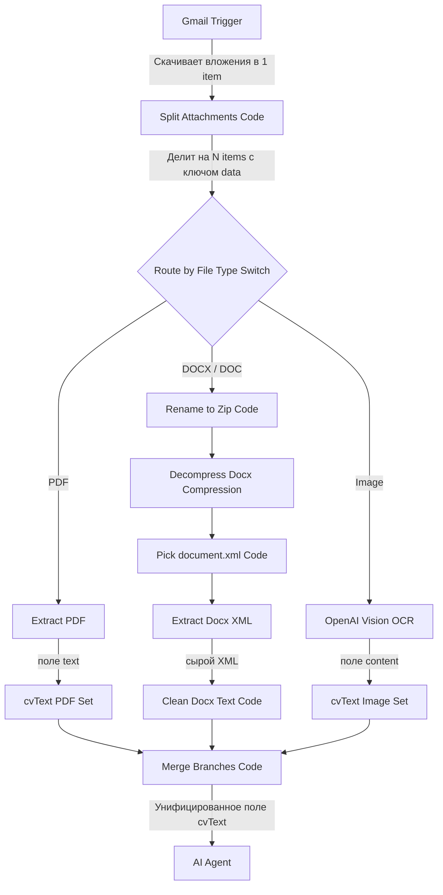

# Руководство по n8n: Мультиформатный импорт резюме (PDF, DOCX, Image)

Этот документ содержит разбор практического воркфлоу для **n8n**, который автоматически скачивает вложенные файлы резюме из почты, определяет их тип, извлекает текст (даже из DOCX без платных API и картинок с помощью ИИ) и сводит всё к единому текстовому полю для передачи в LLM.

---

## 📂 Ссылки на исходные файлы в рабочей директории
* **Сценарий n8n (JSON):** [CV Attachments Demo.json](file:///c:/Users/ADMIN/OneDrive/Рабочий стол/portofolio rezume/CV%20Attachments%20Demo.json)
* **Конспект лекции (docx):** [Ефір_—_розбір_воркфлоу_мультиформатний_вхід.docx](file:///c:/Users/ADMIN/OneDrive/Рабочий стол/portofolio rezume/Ефір_—_розбір_воркфлоу_мультиформатний_вхід.docx)

---

## 💡 Базовые концепции n8n, которые нужно знать

### 1. Что такое `item` (элемент)?
Представьте конвейер, по которому едут коробки. Каждая коробка — это **item**. 
Внутри коробки два отделения:
* **json** — обычные данные (текст, числа, статусы). Это то, что отображается в таблицах.
* **binary** — сами файлы (картинки, PDF, архивы). Они слишком «тяжелые», чтобы лежать в текстовом виде, поэтому хранятся отдельно.

> [!WARNING]
> Gmail складывает **все** вложения из одного письма в **одну** коробку (в binary под ключами `attachment_0`, `attachment_1` и т.д.). Для независимой обработки файлов нам нужно разложить их в отдельные коробки.

### 2. Режимы работы ноды `Code`
* **Run Once for All Items** — код запускается один раз для всей партии коробок. Позволяет изменить количество элементов (например, из 1 коробки с 3 вложениями сделать 3 отдельные коробки).
* **Run Once for Each Item** — код запускается отдельно для каждой коробки (1 входной элемент $\rightarrow$ 1 выходной элемент). Проще писать, но изменять количество элементов этот режим не умеет.

---

## 🛠️ Разбор схемы воркинг-процесса (Workflow)



### 1. Gmail Trigger
Ждет новое письмо. Важная настройка: **Download Attachments = True** (чтобы скачать файлы локально).

### 2. Split Attachments (Code — Run Once for All Items)
Превращает одну коробку с кучей вложений в отдельные коробки для каждого файла. 
**Код JS:**
```javascript
const results = [];
for (const item of $input.all()) {
  const binary = item.binary || {};
  for (const key of Object.keys(binary)) {
    const file = binary[key];
    const fileName = file.fileName || "";
    let ext = file.fileExtension || "";
    if (!ext && fileName.includes(".")) ext = fileName.split(".").pop();
    ext = String(ext).toLowerCase();
    results.push({
      json: { fileName, fileExtension: ext, mimeType: file.mimeType || "", sourceProperty: key },
      binary: { data: file }, // Всегда сохраняем в поле "data"
    });
  }
}
return results;
```

### 3. Route by File Type (Switch)
Сортирует элементы по расширению `fileExtension`.
* **PDF** $\rightarrow$ `.pdf`
* **DOCX** $\rightarrow$ `.docx`, `.doc`
* **Image** $\rightarrow$ `.jpg`, `.jpeg`, `.png`

---

## ⚡ Особенности обработки ветвей

### Ветвь DOCX: Чтение Word без внешних API
Файл `.docx` — это обычный ZIP-архив.
1. **Rename to Zip:** Меняем расширение на `.zip` в метаданных.
2. **Decompress Docx:** Распаковываем нодой *Compression*.
3. **Pick document.xml:** Ищем файл `word/document.xml` (там лежит весь текст).
4. **Extract Docx XML:** Извлекаем содержимое xml-файла.
5. **Clean Docx Text:** Парсим теги `<w:t>` (текст) внутри параграфов `<w:p>`.

**Код очистки XML (JS):**
```javascript
const raw = $input.item.json.data;
function stripDecode(s) {
  return s.replace(/<[^>]+>/g, "")
    .replace(/&amp;/g, "&").replace(/&lt;/g, "<").replace(/&gt;/g, ">")
    .replace(/&quot;/g, '"').replace(/&apos;/g, "'")
    .replace(/&#(\d+);/g, (m, n) => String.fromCharCode(parseInt(n, 10)));
}
function fromXmlString(xml) {
  const paras = xml.split(/<\/w:p>/);
  const lines = [];
  for (const p of paras) {
    const ts = p.match(/<w:t[^>]*>[\s\S]*?<\/w:t>/g) || [];
    if (!ts.length) continue;
    const line = ts.map((t) => stripDecode(t)).join("");
    if (line.trim()) lines.push(line.trim());
  }
  return lines.join("\n");
}
return { json: { cvText: typeof raw === "string" ? fromXmlString(raw) : "" } };
```

### Ветвь Image: OCR через GPT-4o Vision
Картинки отправляются в OpenAI с промптом: *"Вытяни весь текст из этого изображения. Верни только текст, без комментариев."* Результат записывается в `cvText`.

---

## 🎯 Ключевые выводы
1. **Единый контракт данных:** Каждая ветка обработки (PDF, DOCX, Картинка) в самом конце должна отдавать данные в **одном и том же поле** (в данном случае `cvText`). Это делает последующую ноду объединения (`Merge Branches`) тривиальной.
2. **Использование стандартных средств:** Разбор `.docx` через встроенный декомпрессор экономит деньги на сторонних API для парсинга документов.
